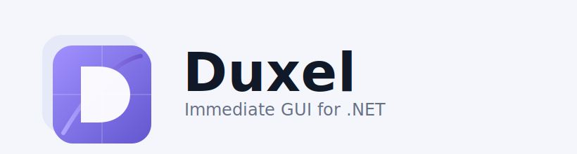

# Duxel

<p align="center">
  
</p>

.NET 10 기반 즉시 모드 GUI 프레임워크로, Vulkan 렌더러와 Windows 네이티브 플랫폼 백엔드를 사용합니다.

**현재 패키지 버전:** `0.2.1-preview`

[](https://www.nuget.org/packages/Duxel.App)
[](LICENSE)

- English: [README.md](README.md)
- 버전 이력: [docs/version-history.ko.md](docs/version-history.ko.md) · [English](docs/version-history.md)
- Duxel 에이전트 참조 문서: [docs/duxel-agent-reference.ko.md](docs/duxel-agent-reference.ko.md) · [English](docs/duxel-agent-reference.md)

## 제공 기능

- `UiScreen.Render(...)` 기반 즉시 모드 위젯 API (`UiImmediateContext`).
- 프로필 기반 렌더 설정(`Display` / `Render`)과 MSAA 설정.
- Windows 네이티브 입력/IME/클립보드 지원.
- NativeAOT 친화 런타임 구성.
- UI DSL(`.ui`) 파서/런타임 및 소스 생성기 경로.

## 패키지

| 패키지 | 용도 |
|---|---|
| `Duxel.App` | 앱 파사드 및 공용 런타임 파이프라인 |
| `Duxel.Windows.App` | Windows 플랫폼 러너 (`DuxelWindowsApp.Run`) |

## 빠른 시작 (FBA, Windows)

`hello.cs`:

```csharp
#:property TargetFramework=net10.0
#:property platform=windows
#:package Duxel.$(platform).App@*-*

using Duxel.App;
using Duxel.Core;
using Duxel.Windows.App;

DuxelWindowsApp.Run(new DuxelAppOptions
{
    Window = new DuxelWindowOptions { Title = "Hello Duxel" },
    Screen = new HelloScreen()
});

public sealed class HelloScreen : UiScreen
{
    public override void Render(UiImmediateContext ui)
    {
        ui.BeginWindow("Hello");
        ui.Text("Hello, Duxel!");
        ui.EndWindow();
    }
}
```

실행:

```powershell
dotnet run hello.cs
```

## 샘플

- 프로젝트 샘플: `samples/Duxel.Sample`
  - `dotnet run --project samples/Duxel.Sample/`
- FBA 샘플: `samples/fba/*.cs`
  - `dotnet run samples/fba/all_features.cs`
  - `./run-fba.ps1 samples/fba/all_features.cs` (로컬 프로젝트 참조, 기본 NativeAOT)
  - `all_features.cs`는 전용 타이포그래피, 레이아웃, 팝업/컨텍스트, 입력 질의, 아이템 상태, 멀티셀렉트, 레이어/애니메이션 쇼케이스 창을 포함합니다.

## DSL

`.ui` 선언형 문법과 상태 바인딩을 지원합니다.

- DSL 문서: [docs/ui-dsl.ko.md](docs/ui-dsl.ko.md) · [English](docs/ui-dsl.md)
- 에이전트 참조 문서: [docs/duxel-agent-reference.ko.md](docs/duxel-agent-reference.ko.md) · [English](docs/duxel-agent-reference.md)
- FBA 시작 가이드: [docs/getting-started-fba.ko.md](docs/getting-started-fba.ko.md) · [English](docs/getting-started-fba.md)
- FBA 참조 가이드: [docs/fba-reference-guide.ko.md](docs/fba-reference-guide.ko.md) · [English](docs/fba-reference-guide.md)
- FBA 샘플 카탈로그: [docs/fba-run-samples.ko.md](docs/fba-run-samples.ko.md) · [English](docs/fba-run-samples.md)
- 커스텀 위젯 문서: [docs/custom-widgets.ko.md](docs/custom-widgets.ko.md) · [English](docs/custom-widgets.md)
- 설계 문서: [docs/design.ko.md](docs/design.ko.md)
- 최적화 정책: [docs/optimization-policy.ko.md](docs/optimization-policy.ko.md)

## 빌드

```powershell
dotnet build Duxel.slnx -c Release
```

## 라이선스

MIT
